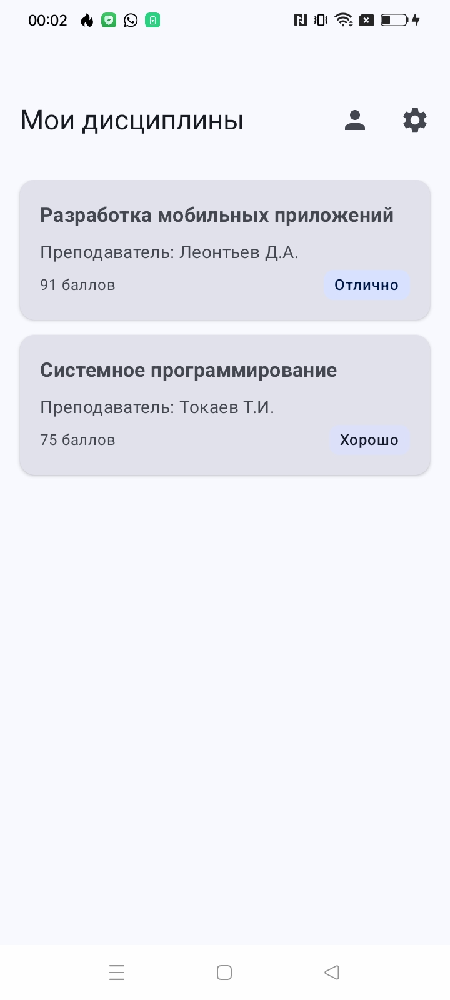
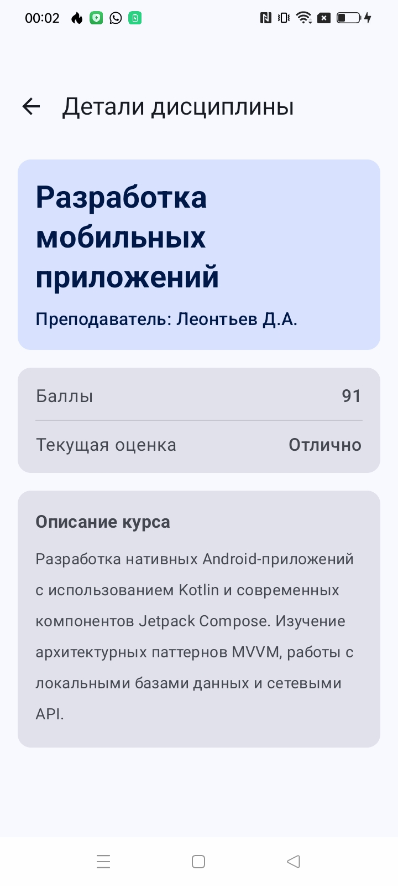
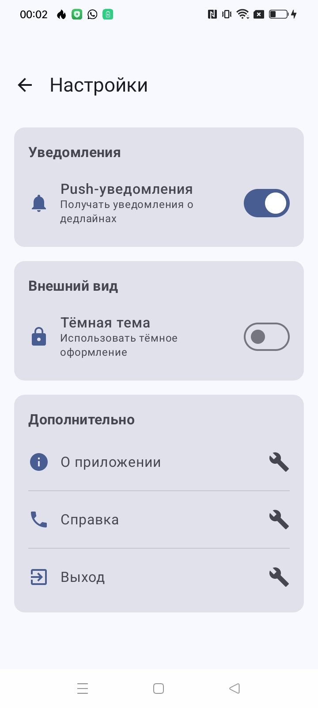

# Student Planner — Студенческий планер

## Основная информация

- **ФИО:** Телятникова Е.П.
- **Группа:** ИСП-231

## Описание приложения

**Student Planner** — позволяет студентам отслеживать список изучаемых дисциплин, просматривать детальную информацию о каждой из них, а также знакомиться со своим профилем и настройками приложения. Проект демонстрирует ключевые принципы работы с библиотекой Navigation Compose, включая передачу данных между экранами и управление стеком навигации.

## Реализованные экраны

*   **Главный экран (`HomeScreen`)** — отображает список учебных дисциплин в виде карточек. Содержит кнопки перехода в профиль и настройки.
*   **Экран деталей (`DetailsScreen`)** — показывает подробную информацию о выбранной дисциплине: название, преподавателя, количество баллов, текущую оценку и описание курса.
*   **Экран профиля (`ProfileScreen`)** — отображает информацию о студенте (ФИО, группа, факультет, email) и статистику (средний балл, кредиты).
*   **Экран настроек (`SettingsScreen`)** — позволяет управлять настройками приложения (Push-уведомления, тёмная тема) и содержит дополнительные пункты меню.
*   **Экран расписания (`TimingScreen`)** - отображает расписание занятий на неделю в виде карточек с указанием дня, времени, дисциплины, аудитории и преподавателя
*   **Экран деталей занятия (`TimingDetailScreen`)** - показывает подробную информацию о выбранном занятии из расписания

## Используемые технологии

*   **Kotlin** — основной язык программирования.
*   **Jetpack Compose** — современный инструментарий для построения пользовательского интерфейса.
*   **Navigation Compose** — библиотека для реализации навигации между composable-экранами.

## Схема навигации

Навигация в приложении построена с использованием `NavHost` и `NavController`. Схема переходов между экранами:
```
Главный экран (Home)
│
├─── Нажатие на карточку дисциплины → Экран деталей (Details) [с параметром subjectId]
│ └─── Кнопка "Назад" → Главный экран
│
├─── Кнопка "Профиль" (иконка Person) → Экран профиля (Profile)
│ └─── Кнопка "Назад" → Главный экран
│
└─── Кнопка "Настройки" (иконка Settings) → Экран настроек (Settings)
│  └─── Кнопка "Назад" → Главный 
│
└─── Кнопка "Расписание" (иконка DateRange) → Экран расписания (Timing)
   └─── Кнопка "Назад" → Главный
```

## Скриншоты основных экранов






## Контрольные вопросы

**1. Что такое NavController и для чего он используется?**
NavController — это центральный компонент управления навигацией, который отвечает за перемещение между экранами, управление стеком back stack и передачу данных между ними.
Создавать его через `rememberNavController()` важно, потому что эта функция сохраняет экземпляр контроллера между рекомпозициями, предотвращая его потерю при перерисовке интерфейса и обеспечивая корректную работу навигации на протяжении всего жизненного цикла приложения.

**2. Как передать параметр в маршрут навигации?**
Процесс передачи параметра начинается с определения маршрута с плейсхолдером (например, `"details/{subjectId}"`), затем при навигации вызывается `navController.navigate("details/123")`, а в NavHost при регистрации маршрута параметр извлекается через `backStackEntry.arguments?.getString("subjectId")` и передаётся в экран.

Разница между обязательными и опциональными параметрами в том, что обязательные параметры являются частью пути и должны всегда присутствовать в маршруте (например, `/{id}`), тогда как опциональные параметры передаются через строку запроса с вопросительным знаком (например, `?query=`) и могут иметь значение по умолчанию, если не указаны.

**3. Зачем использовать sealed class для маршрутов?**
Sealed class обеспечивает типобезопасность (type-safety), объединяя все маршруты в одном месте, что позволяет IDE автоматически подсказывать доступные экраны и исключает возможность опечаток в строковых константах. В отличие от обычных строк, где ошибка вроде `navController.navigate("hom")` обнаружится только во время выполнения приложения и вызовет краш, sealed class выявит такую ошибку ещё на этапе компиляции, поскольку `Screen.Hom` просто не будет существовать.

**4. Что такое Back Stack и как им управлять?**
Back Stack — это стек (LIFO) посещённых экранов, который позволяет пользователю возвращаться к предыдущим экранам с помощью системной кнопки "Назад". Схема back stack для последовательности Home → Profile → Settings выглядит следующим образом:
```
┌─────────────────┐
│ Settings │ ← вершина стека (текущий экран)
├─────────────────┤
│ Profile │
├─────────────────┤
│ Home │ ← дно стека
└─────────────────┘
```
При вызове `popBackStack()` на экране Settings этот экран будет удалён из стека, и пользователь вернётся на экран Profile, после чего стек примет вид: `[Home, Profile]`.

**5. Как работает startDestination в NavHost?**
`startDestination` определяет, какой экран будет отображён первым при запуске приложения — это маршрут, указанный в этом параметре внутри NavHost, например `startDestination = Screen.Home.route` покажет главный экран. Изменить `startDestination` динамически можно, например, добавив условную логику перед созданием NavHost: в зависимости от состояния приложения (первый запуск, авторизация пользователя) можно подставить разные маршруты, но после инициализации NavHost изменить начальный экран уже не получится.

**6. Что произойдёт, если навигировать на несуществующий маршрут?**
Если выполнить навигацию на несуществующий маршрут, NavController не выполнит переход и выбросит исключение `IllegalArgumentException` с сообщением о том, что destination не найден, что может привести к крашу приложения. Обработать такую ситуацию можно, используя sealed class для маршрутов (что исключает ошибки на этапе компиляции), либо обернув вызов `navigate()` в блок `try-catch` для graceful fallback, например, с перенаправлением на главный экран.

**7. Зачем нужен параметр launchSingleTop в навигации?**
`launchSingleTop` предотвращает создание нескольких одинаковых экземпляров одного экрана на вершине стека, что полезно, когда пользователь многократно нажимает на одну и ту же кнопку перехода. Например, без этого параметра при повторных кликах на иконку профиля стек может стать `[Home, Profile, Profile, Profile]`, а с `launchSingleTop = true` дубликаты не создаются, и стек остаётся `[Home, Profile]`. Он влияет на back stack тем, что если целевой экран уже находится на вершине стека, новый экземпляр не добавляется, и при нажатии "Назад" пользователь сразу вернётся к предыдущему экрану, минуя лишние дубликаты.